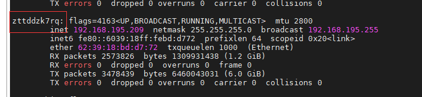
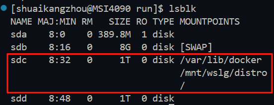
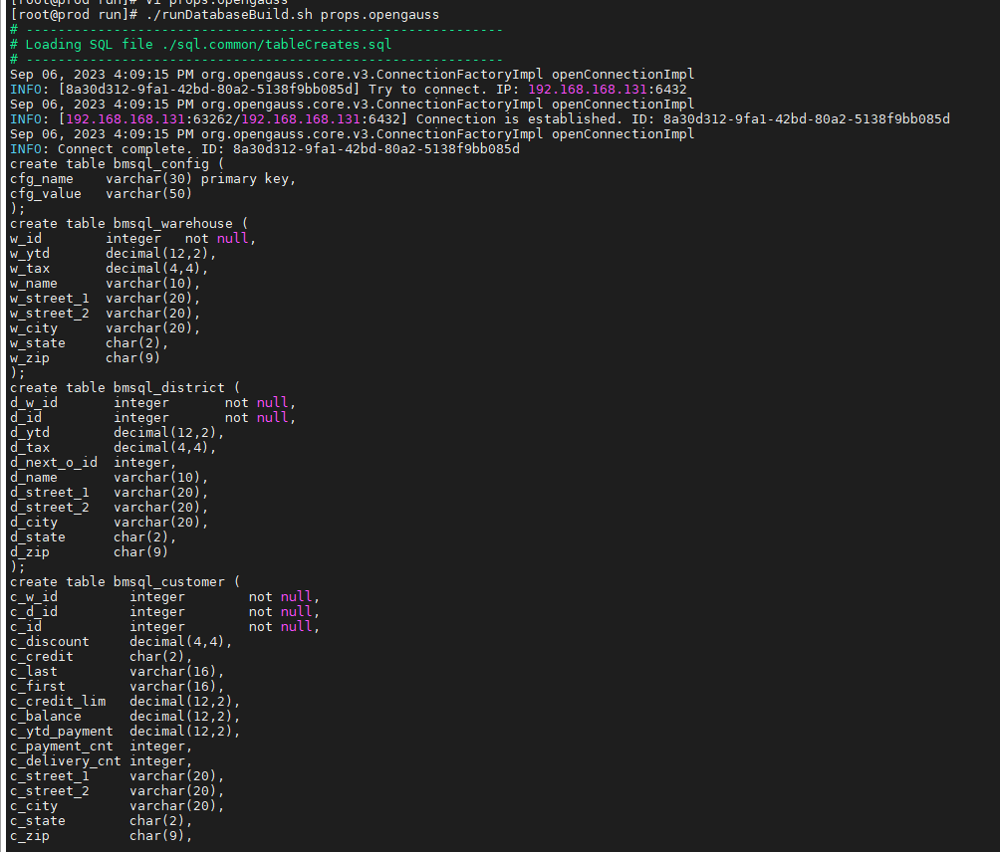
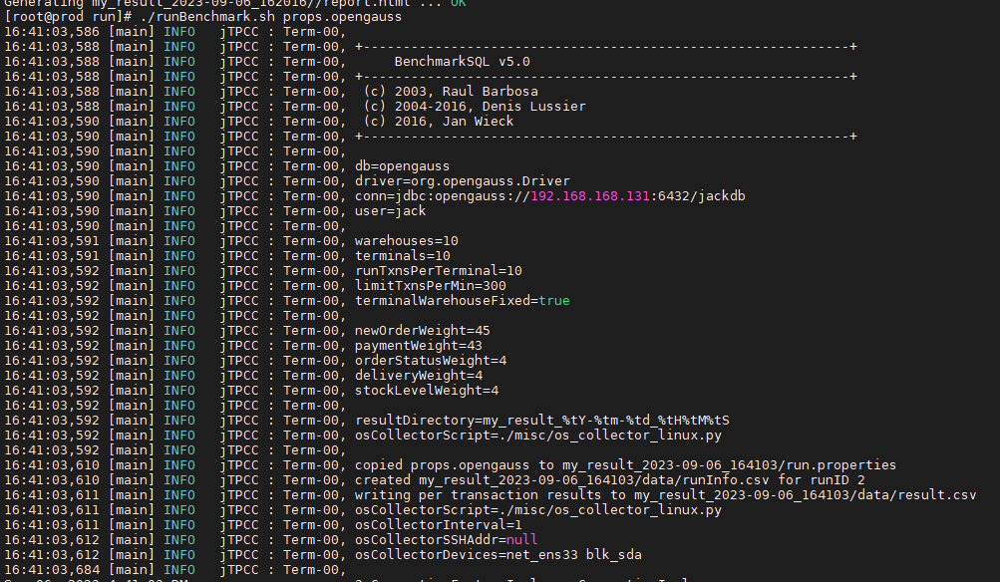
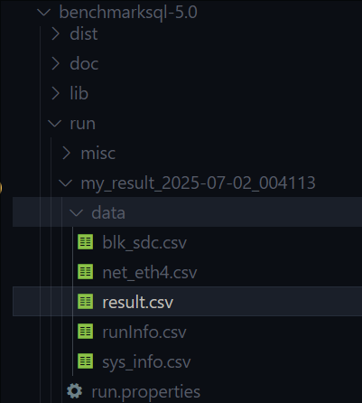
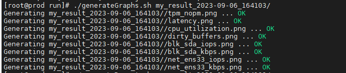
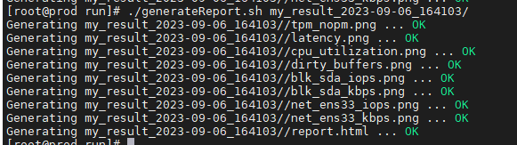
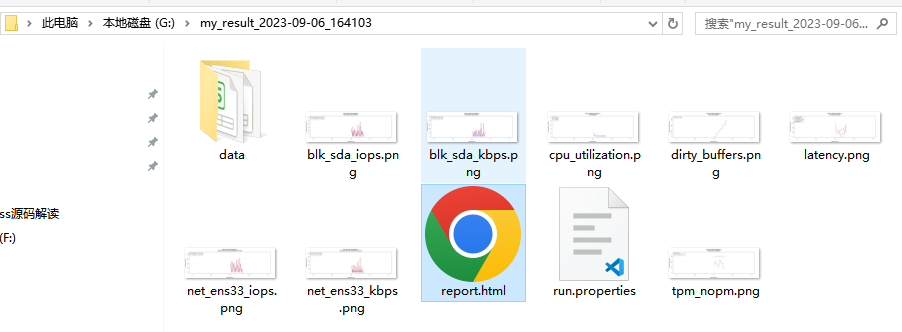

# BENCHMARKSQL README

## 一、环境准备

操作系统：openEuler 22.03 x86_64

前提条件：openGauss已经编译并安装成功，gsql可以正常连接数据库

需要的依赖：ant

```bash
sudo dnf install ant
```

### 1.1 创建新用户

连接数据库`gsql -r -p 5432`，创建远程连接用户tpcc，并授予SYSADMIN管理员权限。

```sql
CREATE USER tpcc PASSWORD 'Tpcc@123';
ALTER USER tpcc SYSADMIN;
create database tpccdb;
```

这里用户tpcc用于做benchmaksql的测试用户，测试数据库为tpccdb，该用户赋予管理员权限。

### 1.2 下载openGauss JDBC驱动

BenchMarkSQL使用JDBC驱动包，连接各种数据库，故需要下载openGauss对应版本的JDBC驱动包。

* 下载地址：[https://opengauss.org/zh/download/](https://opengauss.org/zh/download/)


上传openGauss-5.0.0-JDBC.tar.gz到benchmarksql-5.0/lib/postgres/路径，并解压。openGauss的JDBC驱动解压后有两个jar包（`postgresql.jar`和`opengauss-jdbc-5.0.0.jar`），解压前需要将benchmarksql-5.0/lib/postgres/路径下原有的`postgresql.jar`文件删除，然后将解压后的两个jar包复制到benchmarksql-5.0/lib/postgres/路径下。

```bash
cd ~/benchmarksql-5.0/lib/postgres/
# 删除原有的postgresql.jar
mv postgresql.jar postgresql.jar.bak
tar -xzvf openGauss-5.0.0-JDBC.tar.gz
```

### 1.3 编译BenchMarkSQL

```bash
cd ~/benchmarksql-5.0
ant

# 输出以下内容
    Buildfile: /nas1/home/wieck/benchmarksql.git/build.xml

    init:
        [mkdir] Created dir: /home/wieck/benchmarksql/build

    compile:
	[javac] Compiling 11 source files to /home/wieck/benchmarksql/build

    dist:
	[mkdir] Created dir: /home/wieck/benchmarksql/dist
	  [jar] Building jar: /home/wieck/benchmarksql/dist/BenchmarkSQL-5.0.jar
    BUILD SUCCESSFUL
    Total time: 1 second
```

### 1.4 安装依赖

```bash
pip3 install -r requirements.txt
```

## 二、修改配置

### 2.1 创建openGauss的props文件

benchmarksql-5.0/run/ 路径下的 Props.\*为BenchMarkSQL的测试配置文件，在生成测试数据和执行测试时，BenchMarkSQL都会使用该文件。

可复制已有的props.\*模板，修改为可用于openGauss的配置文件。

```bash
cd ~/benchmarksql-5.0/run
cp props.pg props.opengauss
nano props.opengauss
```

写入如下信息，具体配置根据注释修改

```yaml
db=postgres
driver=org.postgresql.Driver
// 数据库的ip、端口和数据库名
conn=jdbc:postgresql://127.0.0.1:33000/tpccdb
// 前面创建的数据库用户名
user=tpcc
// 数据库密码
password=Tpcc@123

// 数据仓数量
warehouses=100
// 数据创建工作线程数
loadWorkers=25

// 测试过程的连接终端数（并发数）
terminals=100
// 每个终端运行的事务数，该参数与下面的runMins是两种测试策略，所以设置每个终端运行的事务数之后测试时间必须设置为0
runTxnsPerTerminal=0
// 测试时间，如果设置了测试时间，那么runTxnsPerTerminal参数必须为0
runMins=15
//Number of total transactions per minute，0代表无限制
limitTxnsPerMin=0

//Set to true to run in 4.x compatible mode. Set to false to use the
//entire configured database evenly.
terminalWarehouseFixed=false

//The following five values must add up to 100
//The default percentages of 45, 43, 4, 4 & 4 match the TPC-C spec
newOrderWeight=45
paymentWeight=43
orderStatusWeight=4
deliveryWeight=4
stockLevelWeight=4

// Directory name to create for collecting detailed result data.
// Comment this out to suppress.
resultDirectory=my_result_%tY-%tm-%td_%tH%tM%tS
osCollectorScript=./misc/os_collector_linux.py
osCollectorInterval=1
// 服务器ssh连接的用户名和地址（Tpcc测试机必须跟数据库服务器设置ssh互信）
osCollectorSSHAddr=shuaikangzhou@127.0.0.1
// 监控的磁盘和网卡，可以设置多个，用空格隔开，网卡命名方式net_xxx，xxx是设备名,磁盘命名方式 blk_xxx，xxx是磁盘名
osCollectorDevices=net_eth4 blk_sdc
```

* 数据库所在服务器网卡查看方式

  ```bash
  ifconfig
  ```

  

  这里网卡显示为zttddzk7rq，全拼写成 net\_zttddzk7rq

* 数据库所在服务器磁盘查看方式

  ```bash
  lsblk
  ```

  选择数据库数据存储目录所挂载的磁盘，这里显示整个根目录(/)都挂载到sdc磁盘了，所以磁盘名为blk_sdc

  


## 三、开始测试

### 3.1 生成测试数据。

```bash
cd ~/benchmarksql-5.0/run
./runDatabaseBuild.sh props.opengauss
```



### 3.2 压力测试

```bash
 ./runBenchmark.sh props.opengauss
```



测试完成之后会在当前目录下生成测试结果，位于./my_result_xxxx-xx-xx_xxxx文件夹下



### 3.3 生产压测报告

该操作需要安装Python3，确保依赖安装完成

```bash
pip3 install -r requirements.txt
```

* 生成报告

```bash
cd benchmarksql-5.0/run
./generateGraphs.sh my\_result\_2023-xx-xx\_xxxxxx
./generateReport.sh my\_result\_2023-xx-xx\_xxxxxx
```

* 生成图片



* 生成报告



下载my\_result\_2023-05-04\_142051文件夹到桌面，使用浏览器打开文件夹内的report.html文件



### 3.4 清理数据

该操作会将数据库仓库全部删除，再次测试需要重新创建数据

```bash
./runDatabaseDestroy.sh props.opengauss
```

## 四、其他说明

### 4.1 修改openGauss监听地址

默认配置只能本机连接数据库，为了不影响性能，TPCC客户端尽量不要跟数据库在同一台机器上，此时需要修改数据库的配置以便局域网内的其他设备可以连接。

找到数据库的数据目录

1. **编辑** **`pg_hba.conf`** **配置文件**

    添加连接配置

    ```bash
    host    all             all             172.19.0.0/16            sha256
    ```
2. 编辑`postgresql.conf`文件

    编辑配置文件，将：

    ```ini
    listen_addresses = 'localhost'  # 或默认只监听127.0.0.1
    ```

    修改为：

    ```ini
    listen_addresses = '*'  # 允许监听所有网络接口（包括局域网IP）
    ```

    也可以指定具体的局域网 IP（如`172.19.0.209`），但`*`更灵活。

3. 重启数据库

## 五、自动化测试脚本

[点击查看](./run/README.md)