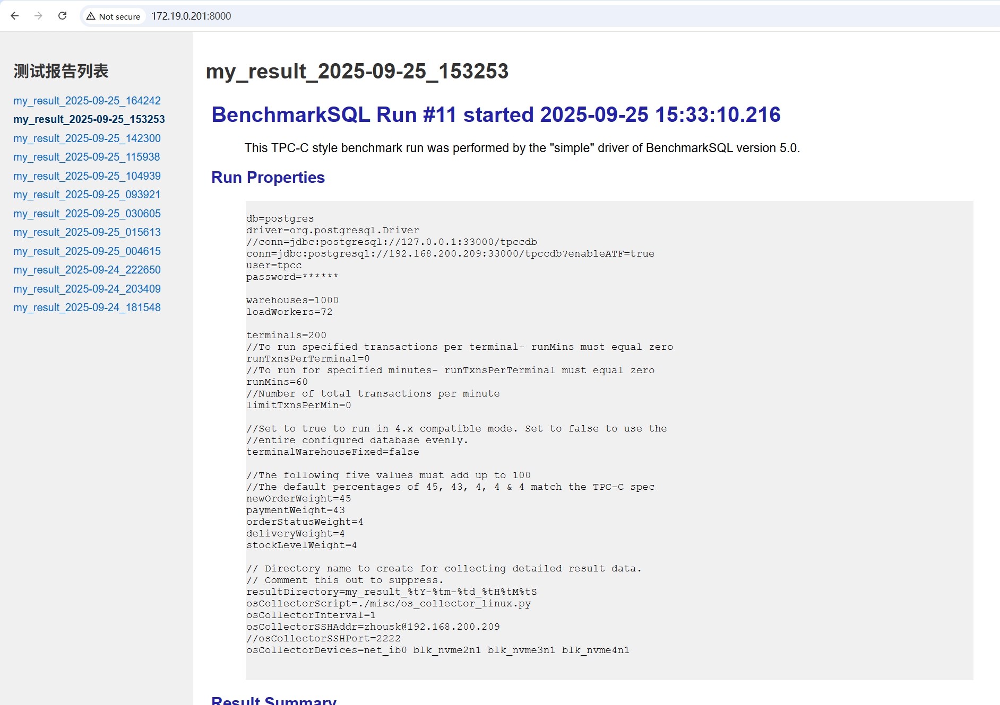

# runTpcc 使用说明

```bash
sh runTpcc.sh -a -c -w 200 -n 3
```

## 参数说明

* -a: 开启ATF，默认不开启
* -c: 重建数据仓，默认不重建（相关细节在server.sh里）
* -w k: 数据仓大小（仅支持200、400、1000），默认为200
* -n k: 连续测试k次，默认为1
* -m jvm_max_mem: 限制JVM最大堆内存，默认不限制

## 前置准备
1. 修改props.* 文件里的连接参数
2. 打开server.sh，根据教程修改下面几个变量

```bash
# 远程服务器信息 - 请根据实际情况修改以下信息

remote_server="zhousk@192.168.200.209"

# 远程服务器用户名和主机地址，例如：root@192.168.1.100，需要与本机设置互信

db_dir="/mnt/nvme2n1/zhousk/data/data_n1"
TABSPACE2_DIR="/mnt/nvme3n1/zhousk/data/data_n1"
TABSPACE3_DIR="/mnt/nvme4n1/zhousk/data/data_n1"

XLOG_DIR="/mnt/raid0/zhousk/data/data_n1/pg_xlog"

backup_dir="/mnt/nvme4n1/zhousk/backup/${warehouses}w"
```

1. benchmarksql测试机与数据库服务器配置互信

2. 创建原始数据，根据[教程](../README.md)分别生成仓数为100、200、1000的数据库，分别将整个数据库目录备份到backup_dir文件夹下

    例如：100仓的数据库目录为/mnt/nvme4n1/zhousk/backup/100w

3. 数据分盘，在不同硬盘上分别创建以下四个文件夹并把实际目录写到server.sh文件里

    * db_dir：测试数据库数据目录
    * TABSPACE2_DIR：数据表空间的软连接地址（在其他磁盘上）
    * TABSPACE3_DIR：另一个数据表空间的软连接地址
    * XLOG_DIR：xlog软连接地址

> PS: 为避免数据干扰每次测试前都会，删除四个文件夹下的数据然后将对应仓数的备份数据复制到db_dir下，然后创建四个软连接将数据分散到多个硬盘上

## 查看报告

使用`runTpcc.sh`之后每次测试完成之后都会在结果文件夹下生成一个 `report.html`, 需要将整个文件夹下载到本地才能查看，比较麻烦。

`app.py` 提供了一个网络服务器，可以通过浏览器查看测试报告

### 使用方法

```bash
python3 app.py
```

在浏览器打开 `http://ip:8000` （ip为benchmarksql的ip地址）来查看报告

